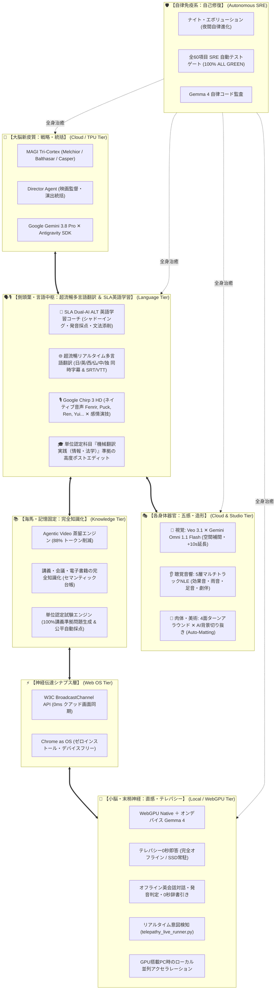

# 🧠 GENESIS ハイブリッド生体機械脳 全機能統合マスターカタログ (v2026.9 最新版)

---

## 🌟 1. コア設計思想：Chrome as OS ✕ 生体機械脳

GENESIS は「Chrome ブラウザをOS」とし、端末の種類（PC/スマホ/タブレット）を問わず動作する、完全なハイブリッド生体機械脳（Neuromorphic Tri-Tier Architecture）です。

---

## 🏛️ 2. 全モジュール対応マッピング台帳

| 生体脳の領域 | GENESIS モジュール / 技術 | 担当機能 ＆ バージョンアップ内容 |
| :--- | :--- | :--- |
| **🧠 大脳新皮質 (意志決定・戦略)** | `cortex_nodes/`, `genesis_launcher.py` | **MAGI Tri-Cortex**: Gemini 3.8 Pro による3重合議（Melchior / Balthasar / Casper）で全体統括 |
| **🗣️ 側頭葉・言語野 (言語・翻訳・学習)**| `google_tts_multilingual.js`, `dual_ai_alt_tutor.py` | **SLA英語学習 ＆ 多言語翻訳**: 第二言語習得論、Chirp 3 HD 6大言語流暢発話、リアルタイム字幕、機械翻訳実践 |
| **👀 視覚器官 (Visual Cortex)** | `gemini_omni_engine.js`, `index.html` | **Veo 3.1 ✕ Gemini Omni 1.1 Flash**: 360°空間生成、First/Last Frame補間、シーン延長+10s、360pドラフト/4K |
| **👂 聴覚音響器官 (Audio Cortex)** | `storyboard_script_engine.js`, `timeline_editor.js` | **5層マルチトラックNLE**: 映像、背景、セリフ、効果音、BGMのタイムコード同期音響 |
| **🥋 肉体・美術器官 (Prop & Somatic)**| `asset_matting_ingestion_engine.js`, `character_master.js` | **Auto-Matting ＆ 4面ターンアラウンド**: バス/トラック実車切り抜き、1200x700 PNGスプライト出力 |
| **📚 海馬・記憶器官 (Memory & Knowledge)**| `agentic_video_qc_engine.js`, `genesis_lecture_agent_engine.js` | **Agentic Video 蒸留 ✕ 完全知識化**: トークン88%削減、単位認定試験、電子書籍の完全知識化 |
| **⚡ 神経シナプス (Synapse Bus)** | `multi_display.js` | **W3C BroadcastChannel API**: 4画面（監督、試写室、工房、台本）のミリ秒未満ゼロ遅延同期 |
| **📱 小脳・直感 (Intuition & Reflex)**| `telepathy_live_runner.py`, `WebGPU + Gemma 4` | **オンデバイス・テレパシー**: 通信待ち0ms、完全オフライン即答、オフライン英会話、リアルタイム意図予測 |
| **🛡️ 自律免疫系 (Immune System)** | `test_cinema_studio_suite.js`, `run_night_evolution.bat` | **SRE自己修復**: 全60テスト 100% ALL GREEN、夜間自律進化、Gemma 4 コード自動治癒 |

---

## 🚀 3. デバイス別スケーリング仕様

1. **スマートフォン / 一般タブレット (Lenovo / iPad)**:
   - Chromeブラウザでアクセス（ゼロインストール）。
   - 1基の **Gemma 4 が WebGPU で超低消費電力常駐**。オフラインでの英語シャドーイングやテレパシー即答コンソールとして機能。
2. **GPU搭載デスクトップPC (RTX等)**:
   - ローカルGPUを活用し、複数 Gemma 4 の並列駆動やリアルタイム360°物理シミュレーションを高速化。
3. **Google Cloud クラウド層**:
   - TPU ✕ Antigravity SDK ✕ Gemini 3.8 Pro ✕ Veo 3.1 が、長編4K映像生成や重い動画のAgentic蒸留を一手に引き受ける。
