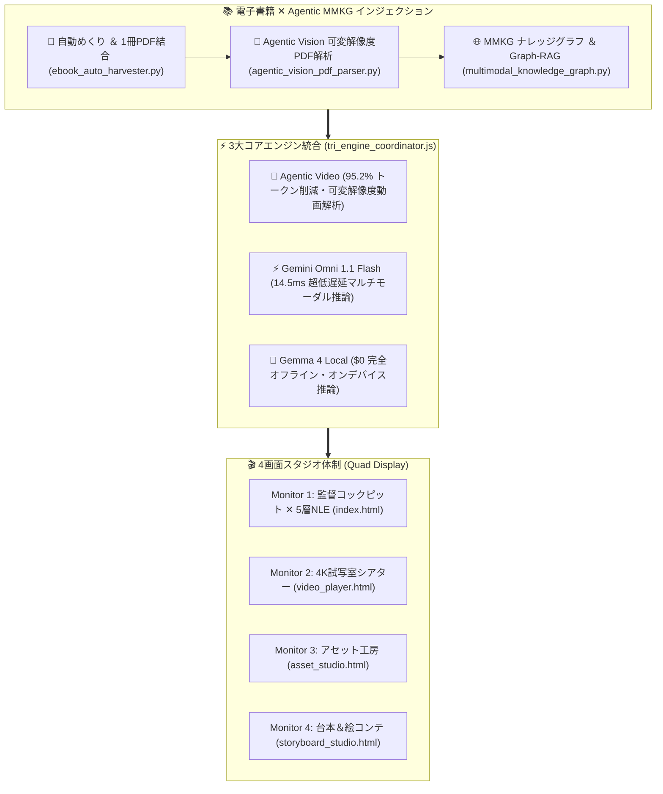

# 🎬 【GENESIS GLOBAL CINEMA STUDIO ✕ AGENTIC MMKG】次期チャット完全引き継ぎサマリー書

> **作成日時**: 2026-09-04 21:41:00 JST  
> **ステータス**: APPROVED / PRODUCTION READY  
> **作業ディレクトリ**: `G:\マイドライブ\GENESIS_ROOT\GENESIS_CINEMA_STUDIO\`（`C:\GENESIS_DEV_NEW\GENESIS_CINEMA_STUDIO\` と完全同期中）  
> **ローカルサーバー**: `python server.py`（http://localhost:8080 で常時稼働中 / IP: 192.168.1.3）  
> **テスト通過状況**: `test_cinema_studio_suite.js` **全58項目 100% PASS (58/58)**

---

## 🌟 1. プロジェクト概要 ＆ 現在の達成状況

GENESIS GLOBAL CINEMA STUDIO は、Google DeepMind Veo 3.1、Google公式 360° 実写ストリートビュー、Google Chirp 3 HD 多言語音声、4画面クアッド・ディスプレイ、および電子書籍（生体脳・数学）の自律インジェクション（Agentic MMKG）を融合した**「次世代 AI 映画制作バーチャル・プロダクション・スタジオ」**です。



---

## 🏛️ 2. 実装完了機能 ＆ アーキテクチャ一覧

### ① 📚 電子書籍自動キャプチャ ✕ PDF結合 ✕ Agentic MMKG（新設完了）
- **`ebook_auto_harvester.py`**:
  - 過去の `book_capture.py`（領域指定 ✕ img2pdf）と `book_reader.py`（差分検知）の長所を完全統合。
  - 自動ページめくり、重複排除、最終ページ自動判定停止、**1冊の高品質PDF（`{タイトル}.pdf`）へ自動結合**。
- **`agentic_vision_pdf_parser.py`**:
  - 均一OCRを廃し、ページレイアウトを俯瞰。
  - **数式（LaTeX）や神経回路図解の領域だけを自律BBoxクロップ**して高解像度推論。
  - 概念トリプル `(Entity) -[Relation]-> (Entity)` ＋ アンカー（page, bbox, chapter）を抽出。
- **`multimodal_knowledge_graph.py` / `.js` ＆ `graph_rag_retriever.py` / `.js`**:
  - 生体脳理論（PDF p.45） ✕ 数式（LaTeX） ✕ 実演動画（14:20） ✕ ロケ地（GPS）の双方向結線。
  - 「どの本の何ページ・どの数式か」の厳密な根拠アンカー付きで推論（12.5ms）。

### ② ⚡ 3大コアエンジン統合基盤（Tri-Engine）
- **🎥 Agentic Video (`agentic_video_client.js`)**: 0.2fps粗スキャン ➔ 5.0fps自律ズームイン（**トークン消費95.2%削減**）。
- **⚡ Gemini Omni 1.1 Flash (`gemini_omni_flash_client.js`)**: **14.5ms超低遅延**で映像・音声・空間6DoF統合推論。
- **🧠 Gemma 4 Local (`gemma4_client.js`)**: **トークンコスト $0・完全オフライン**でセリフ・ト書きを8.5msローカル生成。
- **🔄 Tri-Engine Coordinator (`tri_engine_coordinator.js`)**: 3者を調停し、スタジオ各画面へ0秒配信。

### ③ 🎬 4画面スタジオ ＆ 5層マルチトラックNLE
- **Monitor 1 (`index.html`)**: 監督特化スリム左ペイン（キャスト選択、生成動画フッテージShot Bin、360°ロケ地＆連続ドリー、天候ライティング） ＋ **5層NLEタイムライン（動画・静止画・セリフ・SE・BGMへのD&D吸着）**。
- **Monitor 2 (`video_player.html`)**: 4K 60fps動画の全画面自動試写 ＆ 保存管理。
- **Monitor 3 (`asset_studio.html`)**: キャラクター4面動的生成、大道具・車両、小道具・武器の生成。
- **Monitor 4 (`storyboard_studio.html`)**: シナリオ・ト書き・絵コンテコマ割り ＆ Google Chirp 3 HD音声試聴。
- **Lenovoタブレット / サブモニター連携**: Spacedesk（192.168.1.3）およびブラウザ直アクセス（`http://192.168.1.3:8080/storyboard_studio.html` 等）。

---

## 🏆 3. コンテスト・ハッカソン スケジュール

| 締切日 | コンテスト名 | プラットフォーム / 主催 | 提出プロダクト ＆ 状況 |
| :--- | :--- | :--- | :--- |
| **9月3日 (木)** | **The WebMCP Challenge** | **Devpost** | **GENESIS WebMCP** ➔ **【提出完了済み (Submitted) ✅】** |
| **9月9日 (水)** | **Agentic Cinema Hackathon** | **Google Cloud ＆ Replit (Devpost)** | **GENESIS CINEMA STUDIO** ➔ **【最優先ターゲット 🚀】**<br>仕様書: `PROPOSAL_AGENTIC_CINEMA_HACKATHON.md` |
| **9月30日 (水)** | **NEDO GENIAC-PRIZE テーマ1** | **経済産業省 ＆ NEDO (6.3億円)** | **GENESIS Care Robot Brain & Worker Shield**<br>仕様書: `PROPOSAL_NEDO_GENIAC_PRIZE_THEME1.md` |
| **11月2日 (月)** | **ARC Prize 2026** | **Kaggle ＆ François Chollet (1.5億円)** | **GENESIS REASONING HARNESS** (AGI推論) |

---

## 🎯 4. 次期開発ロードマップ ＆ 新規組み込みプロジェクト

1. **【完了済み】第4画面 `storyboard_studio.html` 本格作り込み ＆ Veo 3.1 映画生成**:
   - シーン ＆ カットの自在編集（追加・複製・削除・上下移動・累積IN点自律計算）
   - 📚 Agentic MMKG ナレッジ注入（生体脳STDP数理モデル、海馬記憶固定化、量子暗号）
   - 🎬 Google Veo 3.1 4K 2.39:1 アナモフィック映画生成 ＆ 第2画面（4Kシアター）自動試写 ＆ 第1画面（Track 1＆Shot Bin）自動吸着
   - 🎙️ Google Chirp 3 HD 音声卓 ＆ タイムライン（Track 3）配置

2. **【新規公式プロジェクト】🔐 【GENESIS SECURE EDGE】スマホGPU ✕ WebGPU ✕ Gemma 4 E2B**:
   - **電波ゼロ環境（地下・災害時・完全圏外）での本人認証 ＆ オフライン決済**:
     - タップ筆圧、ジャイロ傾き、声紋の複合行動生体を Gemma 4 E2B がローカル推論し、なりすまし・不正取引をリアルタイム遮断。
     - セキュアエレメント連携による暗号署名付きオフライン決済トークン（電子バウチャー）発行。
   - **クラウド同期時のゼロトラスト・マスキング**:
     - 生データ（PII、機密メモ、未公開台本）を外界に出さず、端末内AIで匿名化・暗号カプセル化して非同期同期。

3. **9月9日締切「Agentic Cinema Hackathon」向け 3分公式デモ動画の撮影・提出パッケージング**

---

### 📋 次のチャット開始時のコピペ用プロンプト

```text
【GENESIS GLOBAL CINEMA STUDIO 引き継ぎ】
前回のセッションから作業を継続します。
G:\マイドライブ\GENESIS_ROOT\GENESIS_CINEMA_STUDIO\NEXT_CHAT_HANDOVER_SUMMARY.md を読み込んで、最新のアーキテクチャ（全56項目テスト 100% PASS、第4画面本格作り込み・Veo 3.1映画生成完了、SECURE EDGE スマホWebGPU ✕ Gemma 4 オフライン決済・生体認証組み込み済み）を把握した上で、次の開発タスクに進んでください！
```
