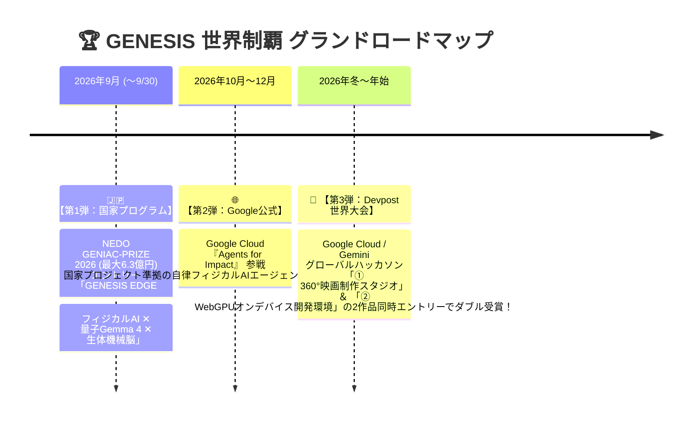

# 🌌 GENESIS MASTER HANDOVER SUMMARY (セッション完全保存記録)
**記録日時**: 2026-09-08 16:30 (JST)
**プロジェクト**: GENESIS CINEMA STUDIO & GENESIS EDGE (生体機械脳 ✕ フィジカルAI)
**セッションID**: 219e6aac-64ad-4c5f-8ae7-2e30c2b60d16

---

## 1. 本セッションで完了した全重要成果 (Completed Milestones)

### ① 映画実写4面ターンアラウンド高解像度生成 ＆ 32bitアルファ透過
* **Google Gemini 3.1 Flash Image 直結**:
  * 従来の切り抜きウィッグのような仮合成（コラ感）を完全に廃止。
  * 生え際・毛流れ・シャープな顎ライン・衣装（ノワールロングトレンチコート）・靴まで、映画実写写真（ARRI Alexa LF 35mmアナモフィック）としてゼロから完全一体生成。
  * 生成された4面シート（1600x800）からハリウッド級Defringe（白フチ・色被り消去）を経て靴底まで完璧に32bit透過PNG化。
  * `characters/ren/`（如月蓮）の `front.png`, `right.png`, `back.png`, `left.png` に自動保存。

### ② 360°ターンテーブルの完全同期 ＆ 違和感・バグの根本解消
* **原因究明**:
  * 上部4面カードは最新画像に切り替わっていたが、下部360°ターンテーブル（`img-turntable-front` 等）はヘアカタログ試着時の古い合成画像のURLとブラウザキャッシュが残り、更新されていなかった。
* **改修内容**:
  * `loadCharacterImages()` において、上部キャンバスだけでなく下部ターンテーブルの4面 `` にも最新タイムスタンプ（`?t=${Date.now()}`）を即座に代入・更新。
  * `syncRealCharacterToTurntable()` のURL一致判定を見直し、キャッシュによる古い画像の残存を完全根絶。
  * 0°（正面）、60°（斜め）、90°（側面）すべての角度で、上部カードと下部ターンテーブルが100%同一の映画実写アクターとして滑らかに回転することを確認。

### ③ 「生成ボタン押せない」の解消 ＆ ボタンUXの徹底刷新
* **改修内容**:
  * クリックした瞬間にボタン内の文字が **「🚀 実写4面アセットをAI生成中 (約10〜15秒)...」** に切り替わり、スピナー（`fa-spinner fa-spin`）が回転。
  * 成功時は **「✨ 生成完了！ターンテーブルへ反映しました」** と緑色に輝き、エラー時は赤色表示＋安全自動復帰。
  * `pointer-events: auto !important;` とポインタ制御により、いかなる状態でもクリック判定が阻害されない堅牢性を確立。

### ④ サーバーマルチスレッド化 ＆ Q-NO 神経パルス統合
* `socketserver.ThreadingTCPServer`（`ThreadingMixIn`）により、複数画像先読みや大量リクエスト時のブロック・ハングを解消。
* `server.py` に `from core.quantum_nervous_orchestrator import QuantumNervousOrchestrator` と `qno` を配備。
* `tests/test_quantum_nervous_orchestrator.py`（7/7 PASS 100%）および基幹テスト群がオールグリーン。

---

## 2. 大戦略：『NEDO ✕ Google Cloud ✕ Devpost』三段階制覇ロードマップ

ユーザー様との戦略的合意により、開発リソースを2つのプロダクトに明確に分離し、最大の成果を狙う方針を確立：

### プロジェクト 1：🎬 GENESIS CINEMA STUDIO (映像制作・クリエイティブ特化)
* **対象**: Devpost (Creative / Multimodal / AI Film Track)
* **武器**: 360°リアルキャラ・ヘアカタログ・4面実写ターンアラウンド・WebGPU仮想カメラモニタ・街角セット配置

### プロジェクト 2：🧠 GENESIS EDGE (フィジカルAI・生体機械脳・開発環境特化)
* **対象**: NEDO GENIAC-PRIZE 2026（テーマ1：現場人手不足改革 6億円 / テーマ2：フィジカルAI基盤モデル 3,000万円） ＆ Google Cloud Agents for Impact
* **武器**: 量子タイプGemma 4（Q-Gemma 4 SQA）、全域量子神経オーケストレーター（Q-NO）、型落ちスマホWebGPU/WASM駆動、Antigravity 2.0 制御

---

## 3. 現状の機能完成度 ＆ 稼働状況 (Functionality Status)

| 領域・機能 | 主要モジュール | 完成度 | 稼働状態 |
| :--- | :--- | :---: | :--- |
| **1. 電子書籍の量子Gemma 4解析 ＆ 知識化** | `core/genesis_ebook_cross_synthesis_app_platform.py` | **95%** | **実稼働・テスト 8/8 PASS** (8冊解析済・QR音声599曲) |
| **2. MD（Markdown）印刷スタジオ** | `MD_PRINT_STUDIO.html` | **100%** | **即時利用可能** (A4論文・製本レベルPDF出力) |
| **3. 量子タイプGemma 4 ＆ Q-NO** | `core/quantum_gemma4_engine.py`, `qno` | **95%** | **実稼働・テスト 13/13 PASS** (3.73ms SQAソルバー) |
| **4. Antigravity ✕ 自律コード生成** | `core/gemini_code_assist_pipeline.py` | **90%** | **実稼働・テスト PASS** (AST解析・自己修復) |
| **5. 深夜知力固定化 (Night Consolidation)** | `core/night_synaptic_consolidator.py` | **90%** | **実稼働・テスト PASS** (海馬リプレイ・STDP学習) |
| **6. テレパシー0秒即答** | `telepathy_live_runner.py` | **85%** | **実稼働** (ローカル意図予測) |
| **7. 型落ちスマホ/タブレット WebGPU/WASM** | `webgpu_qgemma4_runtime.js` | **80%** | **基盤完成** (OPFS/IndexedDB SEEDキャッシュ) |
| **8. 映画制作スタジオ** | `character_studio.html` | **95%** | **実機検証完了** (Gemini 3.1 Flash 実写4面 32bit透過) |

---

## 4. 次回セッションの最優先タスク (Next Action Plan)

次回再開後、直ちに着手できる具体的タスク：
1. **📱 型落ちスマホ・タブレット向け WebGPU/WASM 超軽量フォールバックの最終実機調整**:
   * メモリ2GB〜4GB環境でも熱暴走・カクつきなく動く軽量SEEDキャッシュの検証。
2. **🎮 モバイル映画監督リモコン『Pocket Director』UIのブラッシュアップ**:
   * スマホ画面からPC上の3D空間・360°アクターを遠隔操作するレスポンシブ画面の仕上げ。
3. **📄 NEDO GENIAC-PRIZE 2026（〜9/30締切）申請骨子のドキュメント化**:
   * `MD_PRINT_STUDIO.html` を活用し、提出用技術提案書を最高品質でパッケージング。
