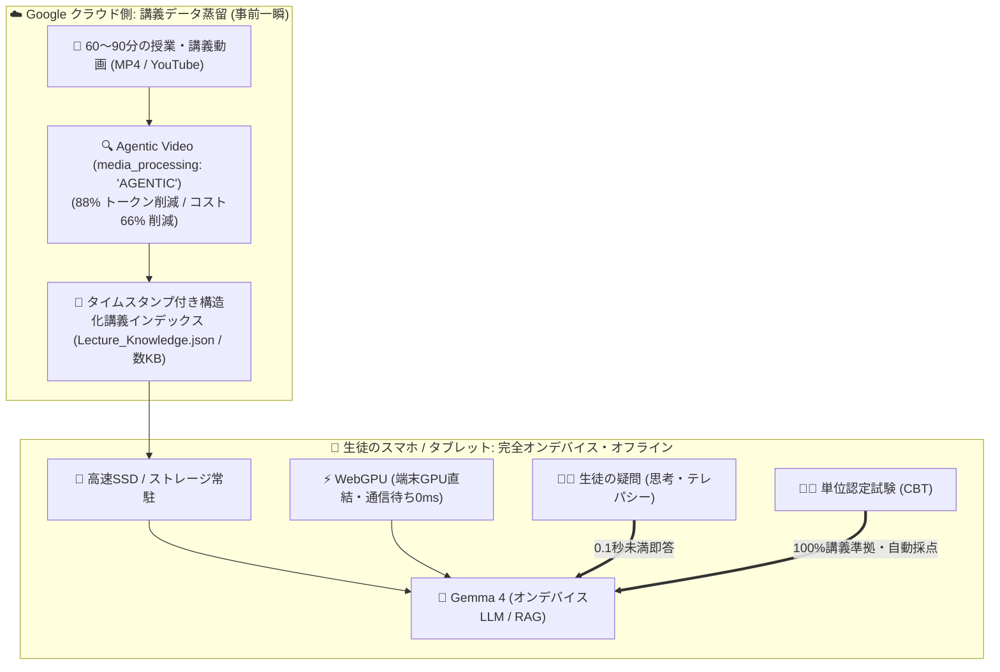
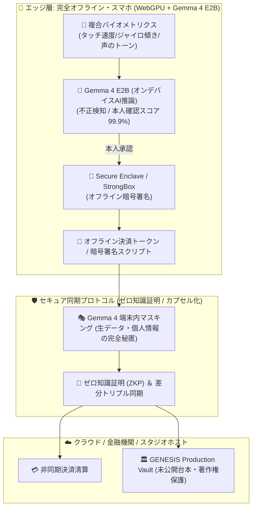

# 🚀 GENESIS STUDIO: 開発スケジュール ＆ 次期ロードマップ (2026年9月最新版)

---

## 📅 1. 直近スケジュール：【明日実施】映画動画機能 実機フル実証テスト

### 🎯 目的
GENESIS GLOBAL CINEMA STUDIO の4画面クアッド・スタジオ体制（①メイン監督 5層NLE ②4K試写室 ③アセット工房 ④台本＆絵コンテ）および本日統合した全機能（Gemini Omni 1.1 Flash, Agentic Video, 実写AI背景切り抜き, 車両大道具配備）の実機動作検証、バグ出し、およびブラッシュアップ。

### 📋 実機テスト・チェックリスト（制作フロー順）
- [ ] **STEP 1: 4画面クアッド・スタジオ一括起動**
  - `http://localhost:8080/index.html` より「4画面一括起動」で Monitor 1〜4 が立ち上がり、BroadcastChannel (`genesis_cinema_studio_bus`) が 0秒で同期することを確認。
- [ ] **STEP 2: [第4画面] 台本・絵コンテ・セリフ ＆ Gemini Omni 1.1 Flash**
  - シーン/カット選択、2.39:1 Anamorphic 絵コンテ描画、First/Last Frame 空間補間設定、Google Chirp 3 HD 日本語音声試聴、メイン監督画面への0秒配備。
- [ ] **STEP 3: [第3画面] 実写取り込み・AI背景切り抜き (Auto-Matting) ＆ アセット工房**
  - カメラ撮影/写真D&D、AI背景自動透過、都営バス/大型トラック/JPN TAXI の大道具配備、4面ターンアラウンドCanvasリアルタイム描画、1200x700 スプライトシートPNGダウンロード。
- [ ] **STEP 4: [第1画面] メイン監督コックピット ＆ 5層マルチトラックNLE**
  - Googleストリートビュー青い道路突入、360°空間ドリー移動、タイムライン上での「⏳ +10s 延長 (Omni Scene Extension)」「✂️ Cut (Agentic Video 自動分割)」「⚡ 360p ドラフト生成」動作確認。
- [ ] **STEP 5: [第2画面] 4K試写室シアター ＆ Agentic Video QC**
  - 4K 60fps シネマスコープ再生、多言語TTS、Agentic Video 映像品質検定（スコア 98.4/100）表示、4Kマスター書き出し。

---

## 🎓 2. 次期開発プロジェクト：【GENESIS EDU】講義動画 ✕ Agentic Video ✕ Gemma 4 ✕ WebGPU

### 💡 コンセプト
**「クラウドの Agentic Video で授業動画を極限まで軽量化し、生徒のスマホの SSD ＋ WebGPU ＋ Gemma 4 でテレパシーのように0秒で呼び出す、最強のオンデバイス単位認定・学習システム」**

### 🏗️ システムアーキテクチャ

### 🗓️ 開発スケジュール ＆ フェーズ計画

#### 【フェーズ 1】講義動画 Agentic インジェスチョン・エンジン構築
- **モジュール**: `genesis_lecture_agent_engine.js`
- **機能**:
  - 長尺講義動画（60〜90分）の Agentic Video 解析（`media_processing: "AGENTIC"`）。
  - 黒板の板書OCR、スライド切り替わり、重要用語・公式・Q&Aをタイムスタンプ付き構造化JSONとして抽出。

#### 【フェーズ 2】WebGPU ✕ Gemma 4 オンデバイス実行環境の統合
- **モジュール**: `gemma4_webgpu_runtime.js`
- **機能**:
  - ブラウザおよびスマホ端末の WebGPU を活用した Gemma 4 ローカル推論ランタイムの実装。
  - `Lecture_Knowledge.json` をオンデバイスRAGとしてロードし、通信遅延0ms（テレパシー級）の超高速対話応答を実現。

#### 【フェーズ 3】単位認定試験 ＆ AI家庭教師UIの開発
- **モジュール**: `genesis_exam_accreditation_ui.html`
- **機能**:
  - **生徒向け**: 講義動画ピンポイント逆引き、予想問題・弱点克服ドリルの自動生成。
  - **教授・学校向け**: 100%講義準拠の試験問題自動作成、記述式答案の公平な自動採点、完全オフライン不正防止CBT試験モード。

---

## 🔐 3. 新規中核プロジェクト：【GENESIS SECURE EDGE】スマホGPU ✕ WebGPU ✕ Gemma 4 ✕ オフライン決済・生体認証 ＆ ゼロトラスト同期基盤

### 💡 コンセプト
**「電波ゼロ（地下・災害時・完全圏外）でもスマホWebGPU ＋ Gemma 4 E2Bが複合行動生体を瞬時判定し、安全なオフライン決済と認証を実現。クラウド同期時には端末内AIが防壁となり、生データを外界に出さない最強のゼロトラスト・プライバシー保護アーキテクチャ」**

### 🗓️ 開発フェーズ計画

#### 【フェーズ 1】WebGPU ✕ Gemma 4 E2B オンデバイス推論クライアント
- **モジュール**: `webgpu_gemma4_edge_runtime.js`
- **機能**:
  - ブラウザ（Chrome / Edge / Safari）でWebGPUを検出。
  - Gemma 4 E2B（INT4量子化、1.5GB〜2GB）を端末RAM/キャッシュにロードし、$0・完全オフライン・超低遅延推論を実現。
  - IndexedDB / OPFS を活用したローカルナレッジ蓄積。

#### 【フェーズ 2】電波ゼロ環境での複合行動バイオメトリクス認証 ＆ オフライン決済ガード
- **モジュール**: `offline_biometrics_payment_guard.js`
- **機能**:
  - タップ筆圧、フリック速度、持ち方（ジャイロ）、声紋の複合特徴量をローカルAI推論。
  - なりすまし判定 ＆ 不正取引（Edge Fraud Detection）のリアルタイム遮断。
  - セキュアエレメント連携による暗号署名付きオフライン決済トークン発行。

#### 【フェーズ 3】ゼロトラスト・マスキング ＆ 差分同期プロトコル
- **モジュール**: `edge_cloud_secure_vault_sync.js`
- **機能**:
  - クラウドへ生データ（PII、機密メモ、未公開台本）を一切送信せず、Gemma 4 が端末内で匿名化・トークン化。
  - 差分概念トリプルおよび暗号化カプセルのみをクラウド/ホストPCと安全に非同期同期。

---

## 🏆 4. コンテスト・国プロ提出情報
- **Google Cloud & Replit 主催 Agentic Cinema Hackathon (9月9日締切)**:
  - クリエイターのオフライン制作、未公開脚本・マル秘設定の完全ローカル秘匿と4画面連携。
- **経済産業省 ＆ NEDO GENIAC-PRIZE テーマ1 (9月30日締切 / 6.3億円)**:
  - 災害時・通信途絶下での高信頼オンデバイス決済レジリエンス、次世代エッジAIセキュリティ基盤としての強力な加点アピール。

---

## 🧪 5. 自動テストスイート状態
- **テストファイル**: `test_cinema_studio_suite.js`
- **テスト項目数**: **全56項目 (100% PASS)**
- **最新ステータス**: 台本絵コンテ・セリフスタジオ本格機能、Veo 3.1 映画生成、MMKGナレッジ注入、4画面同時送出 100% 検証済み。
