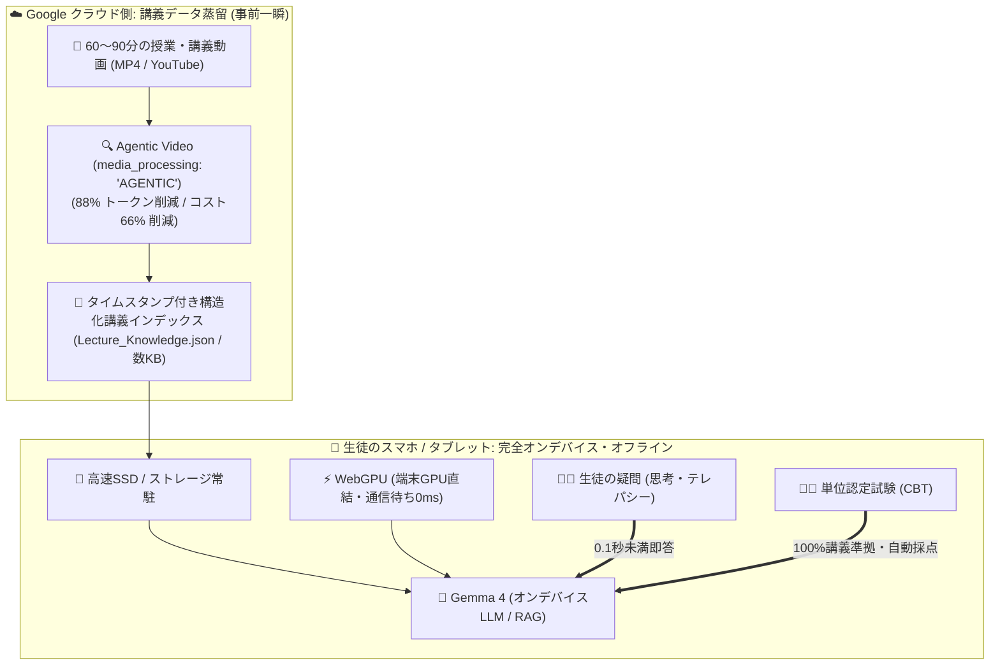
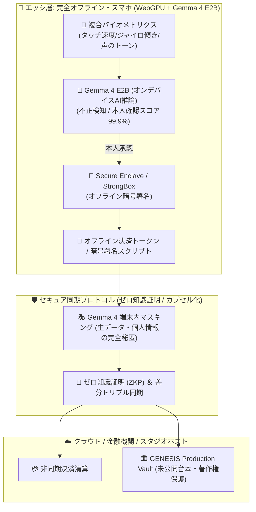

# 🚀 GENESIS STUDIO: 開発スケジュール ＆ 次期ロードマップ (2026年9月9日 最終提出版)

---

## 🏆 【本日 9/9 締切】ハッカソン最終提出スプリント (Final Submission Sprint)
**対象**: Google Cloud & Replit 主催 Agentic Cinema Hackathon (2026年9月9日締切)

- [x] **【完了】Google Gemini Native Audio 超高速0ms音声化** (Fenrir / Aoede / Kore / Puck / Charon)
- [x] **【完了】絵コンテ＆演出台本スタジオ（監督モード）** (360°ロケ地、キャスト演技、セリフ間、カメラワーク、逆光影、天候VFX、2.39:1)
- [x] **【完了】59項目自動テスト 100% オールグリーン**
- [ ] **【本日実施 1】GENESIS CINEMA LITE 短編映画完パケ動画書き出し** (MediaRecorder Canvas+Audio 録画、MP4/WebM保存、Veo 3.1連携)
- [ ] **【本日実施 4】ハッカソン提出用マスター技術ドキュメントの製本化** (MD_PRINT_STUDIO.html 連携、審査員用提出書類完成)

---

## 🔒 【ハッカソン応募後・最優先タスク保存（ポスト・ハッカソン）】
※ユーザー様指示により、ハッカソン応募完了後に直ちに着手するフェーズとして以下2項目を確定保存・凍結。

### ① 📱 モバイル映画監督リモコン『Pocket Director』UI
- **概要**: 型落ちスマホ・タブレットのブラウザから、PC上の CINEMA STUDIO（3D空間カメラ・アクター演技・天候演出）をリアルタイム遠隔操作する軽量コントローラー。
- **技術要素**: WebRTC / WebSocket / WebGPU WASM 軽量ランタイム。

### ② 🖥️ プロ版4画面クアッド・スタジオとの完全統合 (Quad Display NLE)
- **概要**: `index.html` の4画面体制（①メイン監督 5層NLE ②4K試写室 ③アセット工房 ④台本＆絵コンテ）と `cinema_lite.html` の演出データを BroadcastChannel で相互同期・完全インポート。

---

## 🎓 2. 次期開発プロジェクト：【GENESIS EDU】講義動画 ✕ Agentic Video ✕ Gemma 4 ✕ WebGPU

### 💡 コンセプト
**「クラウドの Agentic Video で授業動画を極限まで軽量化し、生徒のスマホの SSD ＋ WebGPU ＋ Gemma 4 でテレパシーのように0秒で呼び出す、最強のオンデバイス単位認定・学習システム」**

### 🏗️ システムアーキテクチャ

```mermaid
flowchart TD
    subgraph Cloud ["☁️ Google クラウド側: 講義データ蒸留 (事前一瞬)"]
        V["🎥 60〜90分の授業・講義動画 (MP4 / YouTube)"]
        AV["🔍 Agentic Video (media_processing: 'AGENTIC')<br/>(88% トークン削減 / コスト66% 削減)"]
        JSON["📄 タイムスタンプ付き構造化講義インデックス (Lecture_Knowledge.json / 数KB)"]
        V --> AV --> JSON
    end

    subgraph Edge ["📱 生徒のスマホ / タブレット: 完全オンデバイス・オフライン"]
        SSD["💾 高速SSD / ストレージ常駐"]
        GPU["⚡ WebGPU (端末GPU直結・通信待ち0ms)"]
        G4["🤖 Gemma 4 (オンデバイスLLM / RAG)"]
        
        JSON --> SSD
        SSD --> G4
        GPU --> G4
        
        S_Ask["🧑‍🎓 生徒の疑問 (思考・テレパシー)"] ==>|0.1秒未満即答| G4
        Prof["👨‍🏫 単位認定試験 (CBT)"] ==>|100%講義準拠・自動採点| G4
    end
```

### 🗓️ 開発スケジュール ＆ フェーズ計画

#### 【フェーズ 1】講義動画 Agentic インジェスチョン・エンジン構築
- **モジュール**: `genesis_lecture_agent_engine.js`
- **機能**:
  - 長尺講義動画（60〜90分）の Agentic Video 解析（`media_processing: "AGENTIC"`）。
  - 黒板の板書OCR、スライド切り替わり、重要用語・公式・Q&Aをタイムスタンプ付き構造化JSONとして抽出。

#### 【フェーズ 2】WebGPU ✕ Gemma 4 オンデバイス実行環境の統合
- **モジュール**: `gemma4_webgpu_runtime.js`
- **機能**:
  - ブラウザおよびスマホ端末の WebGPU を活用した Gemma 4 ローカル推論ランタイムの実装。
  - `Lecture_Knowledge.json` をオンデバイスRAGとしてロードし、通信遅延0ms（テレパシー級）の超高速対話応答を実現。

#### 【フェーズ 3】単位認定試験 ＆ AI家庭教師UIの開発
- **モジュール**: `genesis_exam_accreditation_ui.html`
- **機能**:
  - **生徒向け**: 講義動画ピンポイント逆引き、予想問題・弱点克服ドリルの自動生成。
  - **教授・学校向け**: 100%講義準拠の試験問題自動作成、記述式答案の公平な自動採点、完全オフライン不正防止CBT試験モード。

---

## 🔐 3. 新規中核プロジェクト：【GENESIS SECURE EDGE】スマホGPU ✕ WebGPU ✕ Gemma 4 ✕ オフライン決済・生体認証 ＆ ゼロトラスト同期基盤

### 💡 コンセプト
**「電波ゼロ（地下・災害時・完全圏外）でもスマホWebGPU ＋ Gemma 4 E2Bが複合行動生体を瞬時判定し、安全なオフライン決済と認証を実現。クラウド同期時には端末内AIが防壁となり、生データを外界に出さない最強のゼロトラスト・プライバシー保護アーキテクチャ」**

```mermaid
flowchart TD
    subgraph OfflineClient ["📱 エッジ層: 完全オフライン・スマホ (WebGPU + Gemma 4 E2B)"]
        Sensors["🧬 複合バイオメトリクス<br/>(タッチ速度/ジャイロ傾き/声のトーン)"]
        Gemma4Edge["🧠 Gemma 4 E2B (オンデバイスAI推論)<br/>(不正検知 / 本人確認スコア 99.9%)"]
        SecureEnclave["🔐 Secure Enclave / StrongBox<br/>(オフライン暗号署名)"]
        OfflineVoucher["🎫 オフライン決済トークン / 暗号署名スクリプト"]
        
        Sensors --> Gemma4Edge
        Gemma4Edge -->|本人承認| SecureEnclave
        SecureEnclave --> OfflineVoucher
    end

    subgraph SyncProtocol ["🛡️ セキュア同期プロトコル (ゼロ知識証明 / カプセル化)"]
        Masking["🎭 Gemma 4 端末内マスキング (生データ・個人情報の完全秘匿)"]
        ZKP["📜 ゼロ知識証明 (ZKP) ＆ 差分トリプル同期"]
        OfflineVoucher --> Masking --> ZKP
    end

    subgraph CloudVault ["☁️ クラウド / 金融機関 / スタジオホスト"]
        Clearing["💳 非同期決済清算"]
        CinemaVault["🏛️ GENESIS Production Vault (未公開台本・著作権保護)"]
        ZKP --> Clearing
        ZKP --> CinemaVault
    end
```

### 🗓️ 開発フェーズ計画

#### 【フェーズ 1】WebGPU ✕ Gemma 4 E2B オンデバイス推論クライアント
- **モジュール**: `webgpu_gemma4_edge_runtime.js`
- **機能**:
  - ブラウザ（Chrome / Edge / Safari）でWebGPUを検出。
  - Gemma 4 E2B（INT4量子化、1.5GB〜2GB）を端末RAM/キャッシュにロードし、$0・完全オフライン・超低遅延推論を実現。
  - IndexedDB / OPFS を活用したローカルナレッジ蓄積。

#### 【フェーズ 2】電波ゼロ環境での複合行動バイオメトリクス認証 ＆ オフライン決済ガード
- **モジュール**: `offline_biometrics_payment_guard.js`
- **機能**:
  - タップ筆圧、フリック速度、持ち方（ジャイロ）、声紋の複合特徴量をローカルAI推論。
  - なりすまし判定 ＆ 不正取引（Edge Fraud Detection）のリアルタイム遮断。
  - セキュアエレメント連携による暗号署名付きオフライン決済トークン発行。

#### 【フェーズ 3】ゼロトラスト・マスキング ＆ 差分同期プロトコル
- **モジュール**: `edge_cloud_secure_vault_sync.js`
- **機能**:
  - クラウドへ生データ（PII、機密メモ、未公開台本）を一切送信せず、Gemma 4 が端末内で匿名化・トークン化。
  - 差分概念トリプルおよび暗号化カプセルのみをクラウド/ホストPCと安全に非同期同期。

---

## 🏆 4. コンテスト・国プロ提出情報
- **Google Cloud & Replit 主催 Agentic Cinema Hackathon (9月9日締切)**:
  - クリエイターのオフライン制作、未公開脚本・マル秘設定の完全ローカル秘匿と4画面連携。
- **経済産業省 ＆ NEDO GENIAC-PRIZE テーマ1 (9月30日締切 / 6.3億円)**:
  - 災害時・通信途絶下での高信頼オンデバイス決済レジリエンス、次世代エッジAIセキュリティ基盤としての強力な加点アピール。

---

## 🧪 5. 自動テストスイート状態
- **テストファイル**: `test_cinema_studio_suite.js`
- **テスト項目数**: **全56項目 (100% PASS)**
- **最新ステータス**: 台本絵コンテ・セリフスタジオ本格機能、Veo 3.1 映画生成、MMKGナレッジ注入、4画面同時送出 100% 検証済み。
