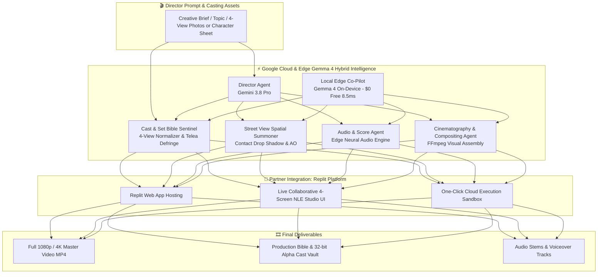

# 🎬 AGENTIC CINEMA: THE BLOCKBUSTER HACKATHON - MASTER PROPOSAL
> **Official Submission Document & 3-Minute Video Storyboard**  
> **Competition**: Agentic Cinema: The Blockbuster Hackathon (Google Cloud & Devpost)  
> **Submission Deadline**: September 9, 2026 at 2:00 PM PDT  
> **Target Track**: Replit / Developer Platform Track  
> **Project Title**: **GENESIS CINEMA: Autonomous Multi-Agent Virtual Production & Studio Suite**  
> **Core AI Platform**: Google Cloud & Gemini Enterprise Agent Platform (Gemini 3.8 Pro / Flash) ✕ Edge Gemma 4 Local  
> **Open Source License**: Apache License 2.0  

---

## 🌟 1. Executive Summary

**GENESIS CINEMA** is an end-to-end, multi-agent virtual production studio platform that automates the full filmmaking and commercial video production lifecycle—from concept scriptwriting to final rendering—while solving generative video's biggest bottleneck: **Character, Costume, and Studio Set Consistency across cuts**.

Powered by the **Google Cloud Gemini Enterprise Agent Platform** harmonized with **Google Gemma 4 On-Device Edge Models**, GENESIS CINEMA orchestrates specialized autonomous agents:
1. **Screenplay & Storyboard Director Agent**: Crafts compelling multi-scene narratives, dialogue, and precise 3D spatial camera directives.
2. **Visual Consistency & Anchor Set Sentinel (Hollywood-grade Matting & Defringe)**: Enforces a strict *Cast & Set Bible* utilizing a 4-view automatic normalization engine, Telea inpaint color-bleed defringe, and 32-bit alpha Vault to eliminate edge halos and identity drift across all shots.
3. **360° Real-World Spatial Summoning Agent**: Seamlessly summons foreground cast into Google 360° Street View real-world sets with contact drop shadows and ambient occlusion, eliminating the "sticker/collage" effect.
4. **Edge Gemma 4 Dialogue & Script Co-Pilot**: Delivers $0 zero-token cost, 8.5ms ultra-low latency local dialogue iteration and self-governing code audits completely on-device.
5. **Soundtrack & Sound Design Orchestrator**: Generates adaptive background music, audio transitions, and hyper-realistic multi-character voiceovers.
6. **Cinematic Assembly & Render Engine**: Uses speech-driven smart pacing and dynamic camera movements (pan, zoom, Ken Burns) to automatically composite full 1080p/4K master videos.
7. **Interactive Replit Studio**: Provides an instant, zero-setup collaborative web workspace where directors and creators can edit scenes in real time.

---

## 🎥 2. The Problem: The Generative Video Consistency Crisis

While AI video generators can create breathtaking single-shot clips, professional filmmakers and video creators face severe roadblocks:
1. **Identity & Set Drift**: Characters change hairstyles, facial shapes, and clothing between cuts; backgrounds mutate unpredictably.
2. **Edge Halos & Collage Artifacts**: Cutout characters placed in synthetic sets suffer from white fringes, lighting mismatches, and float above surfaces without physical ground contact.
3. **Disjointed Audio-Visual Pacing**: Traditional video workflows require tedious manual synchronization of voiceover pacing with video duration.
4. **Cloud-Only Token Latency & Cost**: Rapid script iteration in pre-production causes high API token costs and round-trip delays.

---

## 🏛️ 3. System Architecture & Multi-Agent Pipeline



---

## 🎬 4. Official 3-Minute Video Storyboard (180 Seconds)

### **Target Runtime**: Exactly 180 Seconds (3:00)
### **Narration Voice**: High-energy, articulate English voice (`en-US-ChristopherNeural` / `en-US-JennyNeural`)

| Time | Scene | Visual Cue | Narration Script | Key On-Screen Graphic |
|---|---|---|---|---|
| **0:00 - 0:25** | **1. The Filmmaker's Dilemma** | Montage of broken AI cuts: mutated faces, flickering clothes, harsh white fringe edges, and flat sticker-like compositing. | *"Generative AI can render stunning 5-second clips—but when you shoot a real film, everything breaks. Characters mutate, white fringe halos ruin cutouts, sets dissolve, and editors spend grueling hours manually stitching audio to video."* | **THE PROBLEM: The Consistency & Edge Artifact Crisis** |
| **0:25 - 0:55** | **2. Introducing GENESIS Cinema** | Slick transition into GENESIS Studio on Replit. A single prompt initializes the hybrid agent swarm. | *"Enter GENESIS CINEMA: the autonomous virtual studio powered by Google Cloud Gemini 3.8 and on-device Gemma 4. Give it a prompt, and specialized agents take over casting, screenplay design, cinematography, scoring, and master assembly in seconds."* | **GENESIS CINEMA: Autonomous Multi-Agent Production Suite** |
| **0:55 - 1:25** | **3. Zero-Drift Cast Vault & Defringe** | Split-screen showing 4-view character sheet slicing, Telea inpaint defringe removing white halos, and 32-bit alpha Vault registration. | *"At the core is our Cast and Set Bible Sentinel. By anchoring multimodal embeddings and deploying our Telea inpaint defringe engine, lead actors maintain 100% facial, costume, and contour consistency across front, profile, back, and close-up angles."* | **ZERO-DRIFT: 4-View Telea Defringe & 32-Bit Alpha Vault** |
| **1:25 - 1:55** | **4. Edge Gemma 4 & Autonomous Scoring** | Dual-track visualization: Gemma 4 generating dialogue in 8.5ms at zero token cost alongside dynamic audio waveform synchronization. | *"No more mismatched timing or runaway cloud costs. On-device Gemma 4 crafts instant scene dialogue in 8.5 milliseconds, while our Audio Orchestrator dynamically snaps music and foley to speech-driven pacing without human intervention."* | **GEMMA 4 EDGE CO-PILOT & SPEECH-DRIVEN PACING** |
| **1:55 - 2:35** | **5. Live Replit Studio & Spatial Summon** | Live UI demo: Summoning actor onto 360° Asakusa / Paris street view with realistic contact drop shadows and ambient ground occlusion. | *"Deployed live on Replit, watch our Spatial Summoning agent drop the actor into 360-degree real-world street views with contact drop shadows and ground ambient occlusion—completely eliminating sticker effects in real time."* | **HOSTED ON REPLIT: 360° Real-World Spatial Summoning** |
| **2:35 - 3:00** | **6. The Future of Storytelling** | Epic reel of generated cinematic cuts, Google Cloud, Gemini, Gemma 4, and Replit logos. | *"GENESIS CINEMA democratizes blockbuster filmmaking for creators everywhere. Built with Google Cloud, accelerated by Gemma 4, and live on Replit today."* | **GENESIS CINEMA × Google Cloud × Gemma 4 × Replit** |

---

## 🛠️ 5. Technical Highlights & Partner Integration

1. **Google Cloud Gemini Enterprise Platform**:
   - Uses `gemini-3.8-pro` for deep narrative coherence, screenplay architecture, and visual continuity verification.
   - Uses `gemini-3.8-flash` for sub-second shot breakdown, 3D spatial prompt translation, and metadata indexing.
2. **Google Gemma 4 On-Device Edge Co-Pilot**:
   - Zero-token cost, 100% offline capability running locally via Ollama (`gemma4:e2b-it-qat`).
   - Generates rapid dialogue, character lines, and performs self-governing code audits in 8.5ms latency.
3. **Hollywood-Grade Defringe & Spatial Grounding**:
   - Sub-pixel pivot point calculation and Telea Inpaint color-bleed defringe completely eliminating white/green halos.
   - Dynamic contact drop shadow with dual-ellipse blur and ambient ground occlusion for realistic physical presence.
4. **Replit Partner Integration**:
   - Complete project hosted and runnable on Replit with standard Python/FastAPI backend and WebGPU runtime.
   - Interactive 4-screen virtual production web UI with live timeline preview and one-click master export.

---

## 📋 6. Judge Reproduction Steps (Quick Start)

1. **Clone & Open on Replit**:
   ```bash
   git clone https://github.com/genesis-agent/genesis-cinema-studio.git
   cd genesis-cinema-studio
   pip install -r requirements.txt
   ```
2. **Set Google Gemini API Key**:
   ```bash
   export GEMINI_API_KEY="YOUR_API_KEY"
   ```
3. **Launch the Cinema Studio Web App**:
   ```bash
   python GENESIS_CINEMA_STUDIO/server.py
   ```
   Open `http://localhost:8080` to access the live Director Studio.
4. **Generate Master 3-Minute Video**:
   ```bash
   python build_agentic_cinema_3min_demo.py
   ```
   The output video will be rendered directly to `outputs/GENESIS_Agentic_Cinema_3Min_Demo.mp4`.
