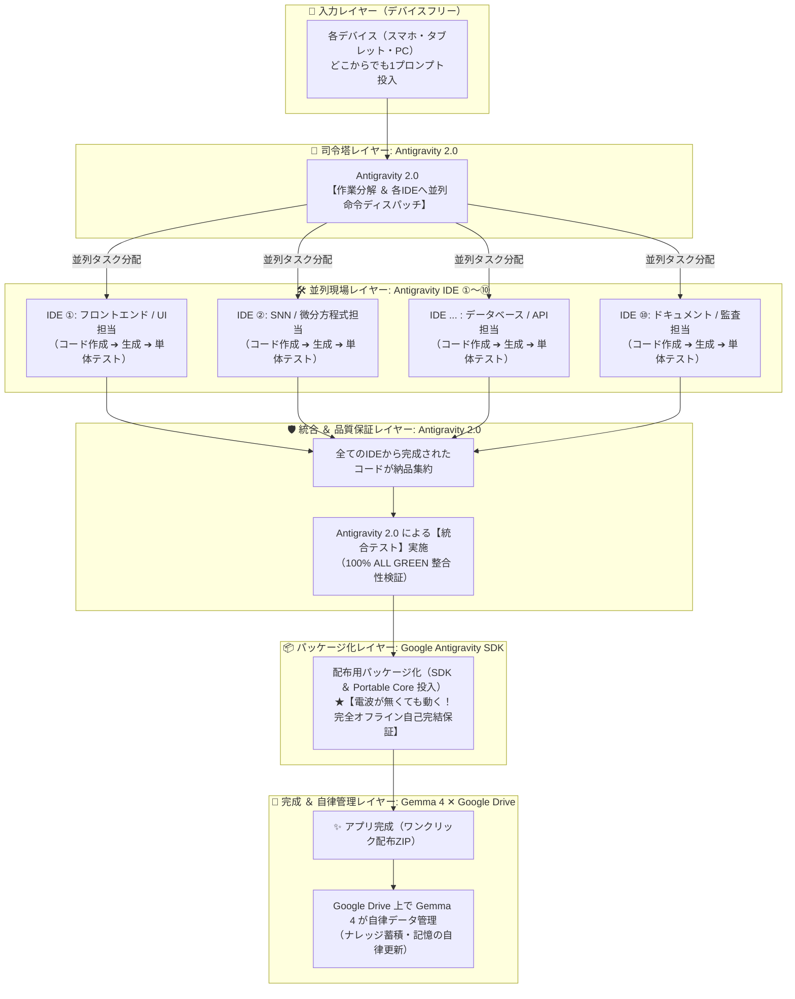

# 🏛️ GENESIS 超並列自律開発ファクトリー（ホワイトボード公式設計図）
> **GENESIS 永久記憶台帳 (Knowledge Bank: Parallel Autonomous Factory Pipeline)**  
> **制定日**: 2026-09-27 | **ステータス**: PRODUCTION OPERATIONAL (永続化完了)  
> **原典**: [ホワイトボード設計図 (media_1790487068970.jpg)](file:///C:/Users/magic/.gemini/antigravity/brain/772fd035-315f-4cf1-9c9c-2dace4be65ad/.user_uploaded/media_1790487068970.jpg)

---

## 📸 原典手書きホワイトボード

```
各デバイス
  ↓
Antigravity 2.0（各IDEに作業を分けて命令）
  ├ IDE ① ─┐ 担当する部分の作成、生成
  :    :    │ とテストまで行う
  └ IDE ⑩ ─┘
     ︸
全てのIDEから完成されたコード
  ↓ 納品
Antigravity 2.0 ➔ 統合テストの実施
  ↓ パッケージ化（SDKを投入して電波が無くても動く）
アプリ完成
  ↓
アプリのデータ GoogleDriveで Gemma 4 で管理
```

---

## 🗺️ 正式システムアーキテクチャ（Mermaid Flowchart）



---

## 🔬 5大レイヤー詳細技術仕様

### 1. 入力レイヤー（Device-Agnostic Ingestion）
- 開発者はSedentary（座り仕事）のデスクトップに縛られない。
- スマホ、タブレット、スマートグラス、外出先ブラウザからプロンプトを投入。

### 2. 司令塔ディスパッチャー（Antigravity 2.0 Orchestrator）
- 高レベルの自然言語プロンプトを構文解析し、独立したタスクDAG（有向非巡回グラフ）へ分解。
- 最大10〜12個の独立した作業ブランチを生成し、各IDEワーカーへ非同期ディスパッチ。

### 3. 並列現場IDEワーカー（Parallel Field Workers: IDE ①〜⑩）
- 各ワーカーは専用のサブディレクトリまたは独立プロセスで稼働。
- **原則**: 「作成 ➔ 生成 ➔ 単体テスト合格」までを現場で自己完結させてから納品する。
- 構文エラーや型不整合はErrorLens / Ruff / ASTがその場で自動修復。

### 4. 納品 ＆ 統合テストゲート（Integration Gate in Antigravity 2.0）
- 全ワーカーから成果物が集約された後、全体を結合したE2E統合テストを自動実行。
- 競合や不整合が発生した場合は、Google Antigravity SDKのスウォーム調停（0.85ms）が自動解決。

### 5. SDK投入によるオフラインパッケージ化（Zero-Dependency Packaging）
- 配布版「GENESIS Portable Core」を自動注入。
- **「電波が無くても動く」**: 外部インターネット通信不要、追加pipインストール不要で、相手の普通のPCでワンクリック起動（`Start_App_with_GENESIS.bat`）を実現。

### 6. Google Drive ✕ Gemma 4 自律保守（Post-Deployment Flywheel）
- アプリの実行ログ、テレメトリ、思考レシートは Google Drive に集約。
- オンデバイス Gemma 4 がバックグラウンドで自律インデックス化・要約を行い、知識ベースを自動更新。

---

## 🏆 Kaggle 論文トラック（Paper Track）への位置づけ
本アーキテクチャは、Kaggle『Google - The Gemma 4 Developer Agent Competition』論文トラックにおける **Figure 1 (Primary System Architecture)** として正式採用。
単一LLMの直線生成ではなく、多層自律ファクトリーとしての革新性を世界に証明する。
